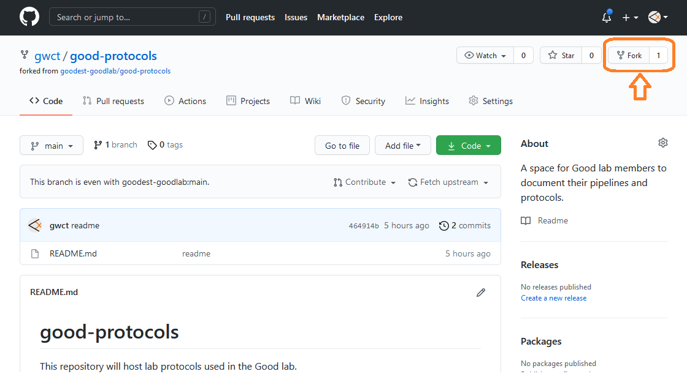
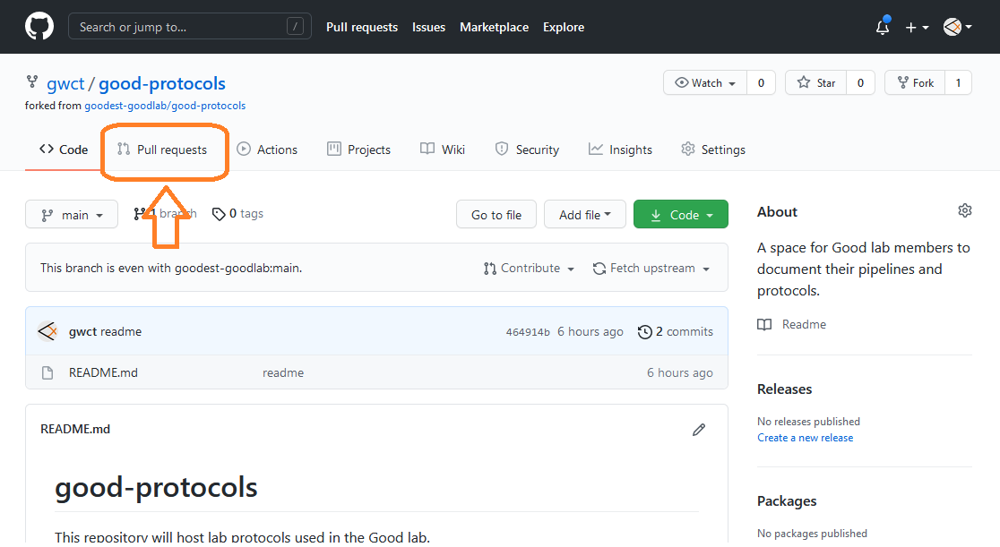

# git pull requests / contributing to repositories

### Author: Gregg Thomas

---

One of the best aspects of git and github is that anyone can contribute to any repository. You may hear someone say that they should "make a pull request" to incorporate the changes that they've made, but how does that work? This guide will try to help explain the process.

Note that this how-to is built largely from [here](https://kbroman.org/github_tutorial/pages/fork.html), with additional context for our use-cases.

# Table of Contents

- [Forking a repository](#forking-a-repository)
- [Uploading changes back to your remote fork](#uploading-changes-back-to-your-remote-fork)
- [Initiating a pull request](#initiating-a-pull-request)
- [Updating a forked repository](#updating-a-forked-repository)

---

## Forking a repository

---

Before you can make changes to another person's repository, you should make a **fork** of that repository. A **fork** is just a copy of a repository at a given point from one user account to another. In this case, you want to make a copy from the owner's account to your own.

The easiest way to **fork** a repository is from the repository's github page. Simply click on the Fork button on the top right:



Select the account to which you want to fork and you should now have a copy of the repository in your own account!

Next, in order to make changes, you'll want to make a local copy of your fork on your local machine. In other words, you need to **clone** your **fork**. You can follow the instructions on cloning a repository [here](../git-basics/README.md#cloning-a-repository). But basically, you will run the command:

```
git clone https://github.com/<git user>/<repository name>.git
```

Here `<git user>` will be your username, and `<repository name>` will be the name of your forked repository. For instance, if I forked and subsequently wanted to clone the `good-protocols` repository, I would type:

```
git clone https://github.com/gwct/good-protocols.git
```

Next, move into your local repository:

```
cd good-protocols
```

**IMPORTANT:** From this point forward, all work will be done within the local repository directory. All commands assume you have changed directories to the repository.

After you clone the repository, you need to add a connection to original repository:

```
git remote add <name for connection> git://github.com/<owner's github id>/<repository name>
```

The `<name for connection>` can be anything, but should contain useful information about the context of the repository. I typically make it the user id of the owner of the repository.

Note that the format for the URLs is slightly different between the `clone` (https://) and `remote add` (git://) commands. You also do not include `.git` when adding the connection.

Explicitly, if I were adding a connection for the `good-protocols` repository, I would type:

```
git remote add goodest-goodlab git://github.com/goodest-goodlab/good-protocols
```

You can check all remote connections for a repository by typing:

```
git remote -v
```

When I type this for my fork of the `good-protocols` repository, I see 4 connections, 2 for my fork (origin) and 2 for the original (goodest-goodlab):

```
goodest-goodlab git://github.com/goodest-goodlab/good-protocols (fetch)
goodest-goodlab git://github.com/goodest-goodlab/good-protocols (push)
origin  https://github.com/gwct/good-protocols.git (fetch)
origin  https://github.com/gwct/good-protocols.git (push)
```

Now you have a local copy of your fork on your machine and you can make any changes you want! If you wanted to add a protocol, you would add a folder and a README for it and any other files.

## Uploading changes back to your remote fork

After you're satisfied with the changes you've made, you'll need to first **push** (upload) them back to the repository stored in your account on github. This does NOT make any requests or changes of the owner's original repository.

You can see instructions for **push**ing changes to a repository [here](../git-basics/README.md#pushing-changes-to-your-repository), but basically it consists of these three commands:

1) Add files to the staging area:

```
git add -A
```

2) Commit files in the staging area to your local repository:

```
git commit -m 'an informative message'
```

3) Pushing the changes in your local repository to the remote one stored on github:

```
git push -u origin main
```

## Initiating a pull request

Once your changes have been pushed back to your remote fork of the repository, you may want to request that they be incorporated into the owner's version of the repository. This is called initiating a **pull request**. Basically, you're just going to ask the owner if they want these changes to be incorporated. The owner will be able to compare the changes made and make the final decision to merge the pull request or not.

To initiate a pull request, go to your forked repository on github and click on "Pull requests" near the top of the page:



On the next page, click on the green "New pull request" button and you will see a comparison of the changed files. Review this and click on the green "Create pull request" button. At this point, the request has been sent to the owner's of the original repository, and they will review the changes.

## Updating a forked repository

This section is pulled from [this guide](https://medium.com/@sahoosunilkumar/how-to-update-a-fork-in-git-95a7daadc14e).

If you've already forked a repository and want to make sure you're working with the latest version from the original repository, you'll need to update the fork. This is where adding the connection to the original repository earlier comes in handy.

1) **Fetch** the original repository:

```
git fetch <name for connection>
```

The `<name for connection>` is whatever you called the repository when you added the connection with `remote add`. You can check the names of your connections by typing `git remote -v`.

In our example, we would type:

```
git fetch goodest-goodlab
```

2) **Checkout** the main branch of your fork:

```
git checkout main
```

3) **Merge** changes between the remote connection and your main branch:

```
git merge <name for connection>/main
```

4) **Push** the merged changes in your local fork to your remote fork:

```
git push origin main
```
